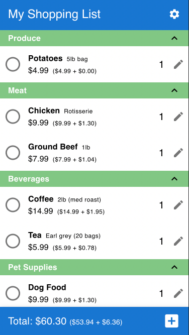
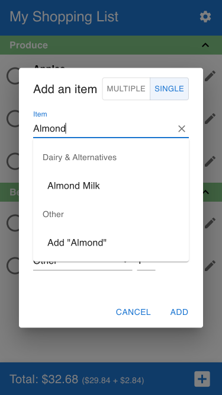
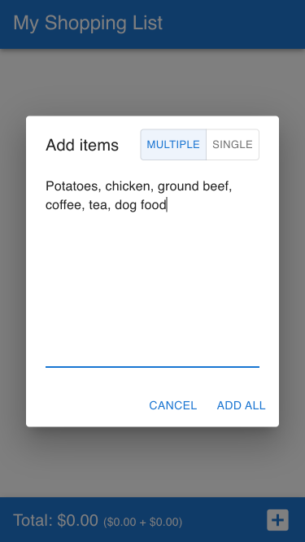
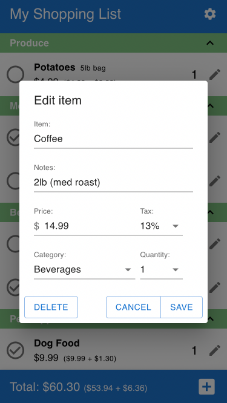
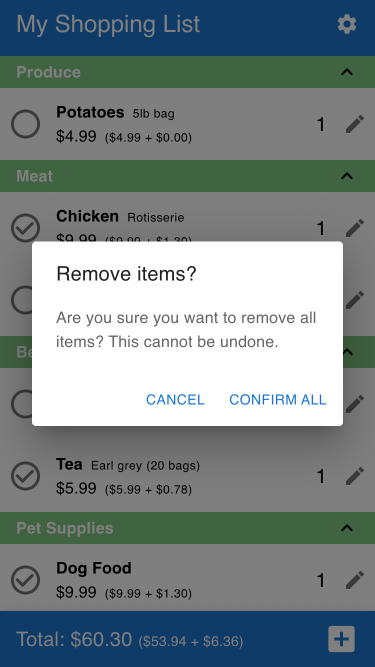

# Grocery Budgeting

## About
The goal of this app is to help people shopping to stick to their budget.

Users can input prices and quantities of items and see if they are within budget.

## Features
- Add items to your list (single or multiple)
- Modify items (name, notes, price, tax rate, category, and quantity)
- Delete items (single or all)
- Autocomplete for common items 
- Common items are automatically categorized
- Open or collapse categories
- Check or uncheck items as you shop
- See your total, subtotal, and taxes at the bottom

## Screenshots
### List of groceries with prices, tax, quantity

### Add single item or multiple items

### Edit item

### Delete items

## User Stories
### MVP
| :white_check_mark: | User Story |
| --- | --- |
| :white_check_mark: | User can add an item to list |
| :white_check_mark: | User can add price to item |
| :white_check_mark: | User can add quantity to item |
| :white_check_mark: | User can add notes to item |
| :white_check_mark: | User can check off items |
| :white_check_mark: | User can see their total |
| :white_check_mark: | User can change edit their items (name, price, notes, quantity) |
| :white_check_mark: | User can remove an item |

### Stretch
| :white_check_mark: | User Story |
| --- | --- |
| :white_check_mark: | User can choose how much tax is applied to item |
| :white_check_mark: | User can edit how much tax is applied to item |
| :white_check_mark: | User can see their total with tax included|
| :white_check_mark: | Users can categorize/tag items |
| :white_check_mark: | Users can have items automatically categorized |
| :white_check_mark: | User lists are automatically sorted alphabetically |
| :white_check_mark: | User lists are automatically sorted by category |
| :black_square_button: | Users can colour-code items |
| :white_check_mark: | Users can choose items from categories |
| :black_square_button: | Users can change the order of their items |
| :white_check_mark: | Users can sort their items in various ways (order added, alphabetical, by price) |
| :black_square_button: | Users can save templates with items |
| :black_square_button: | Users can download `receipts` (list with items and total) |
| :black_square_button: | Users can add priority to items |
| :black_square_button: | Users can save their lists to their account |

## Stack

